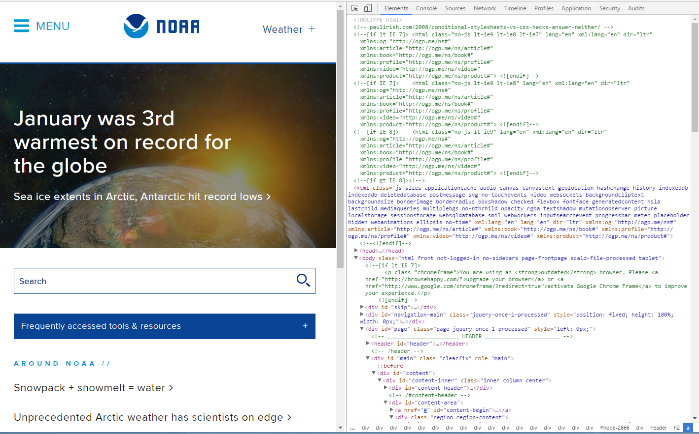
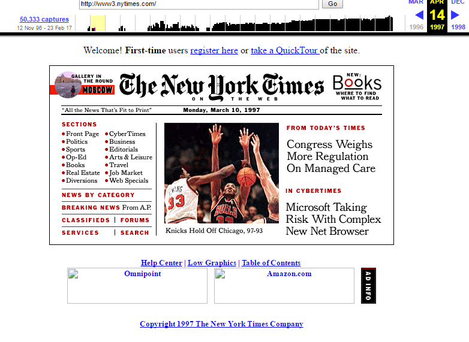
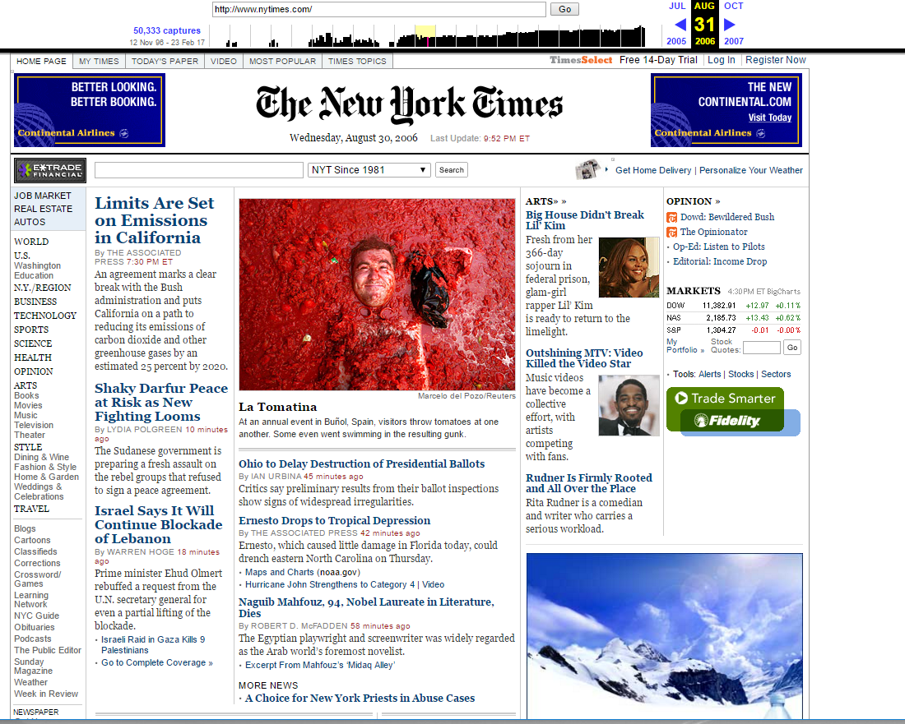
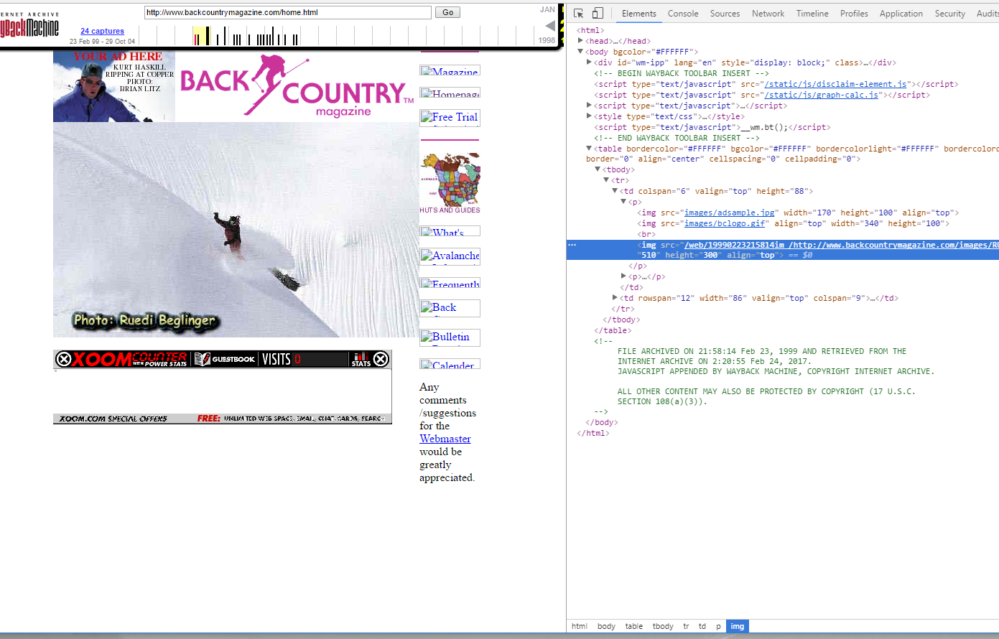
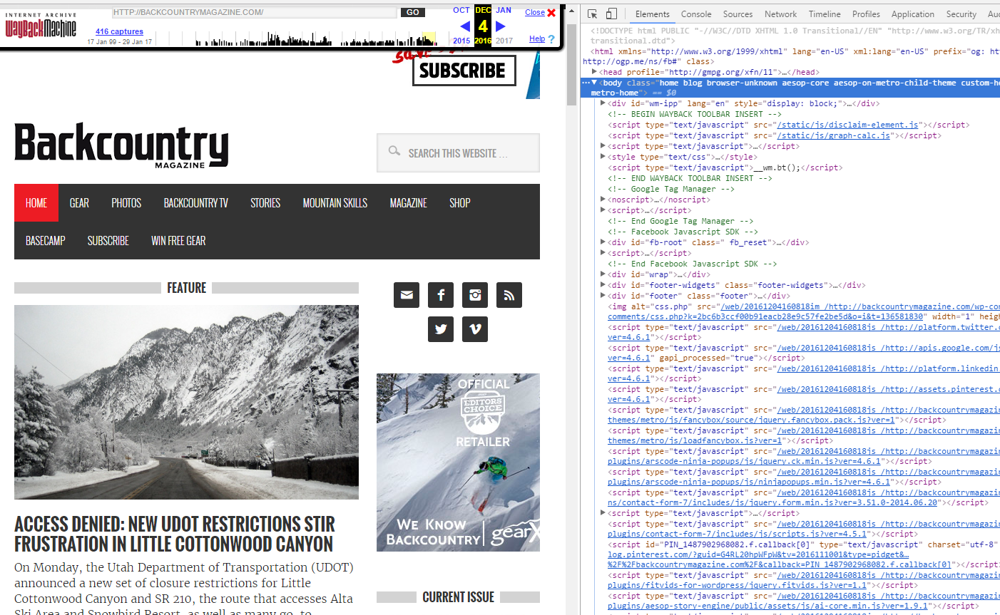

### Marc Hendrickson  Sec:51

# **Week Four Assignment**

## * Overview *

I am definitely getting the hang of and remembering all the steps and commands we
 are working on. Working with Atom and SourceTree has really become second nature,
 although I do think the hardest part was to create the repository in the first
 place. I also tried to complete more tasks using Powershell, which is
 definitely pretty hard to remember all of the specific commands. However, the
 [GitHub website](https://github.com/PowerShell/PowerShell/blob/master/docs/learning-powershell/powershell-beginners-guide.md)
 I found during the first week has been an extremely good reference so that I
 have my most used commands in front of me in case I forget.

 I also enjoyed the Wayback Machine, I have been visiting Archive.org for a
 number of years. I really like how much free material, like books and music
  you can get from that site.

## * Wayback Machine and Website "Snooping"*

For the first website to "snoop" at the code I chose to look at
[NOAA.gov](http://www.noaa.gov). I thought that since it looks like a pretty
website it might have simple code that I could understand. However, I quickly
realized that I was wrong. Just the intro to the actual code that shows up on
the regular screen was longer than the code I wrote for this week's assignment.
I did however find some code that I knew, it only took about 4-5 minutes looking
the rest of the code which still looks like gibberish to me. 

The first website I visited using the Wayback Machine is the New York Times
website. While I may not visit the website everyday now I do get the print
newspaper as well as read a lot of articles on my news feed on my iPhone. It was
very interesting to see how the website has changed over time. Until 1998 the
site looks much like how the print newspaper would look. 
However, as time progressed so did the look of the website. Around 1998 the
website looks a lot more like how we view a professional site today. However, it
does look a lot more crowded than how I picture today's website looking. Around
the middle of 2006 the website starts to look more appealing to the eye I think.
Everything is spread out a little more so the reader isn't getting bombarded
with information and you can focus on just one article. 

The second website I looked at is also a print publication that I get called,
[Backcountry Magazine](https://www.backcountrymagazine.com). While it is not a contemporary artist is it where I go to
view some extremely appealing photography. From what it looks like I think that the magazine went through several stages; from a glorified guidebook of the world all the way to present day where they have videos, photos, articles, and tutorials. As the magazine has matured and grown over those years so has the coding. This is what the coding looked like back in 1999: and this is what the magazine and code looks like now: 

## * Conclusion*
This week was the easiest week so far for me. While it took just as long as the other weeks I am getting the hang of writing html code and the programs we are using. I cannot wait to start using CSS, I think that is why I only understand a small portion of the code on actual websites. It was also fun to see how the websites that I visit everyday have changed over the years.

As of me pushing this final to GitHub I have not helped out any of my classmates. Hopefully all of their weeks go as smoothly as mine, but I will be checking the Wiki everyday to see if there is any questions I can answer.
