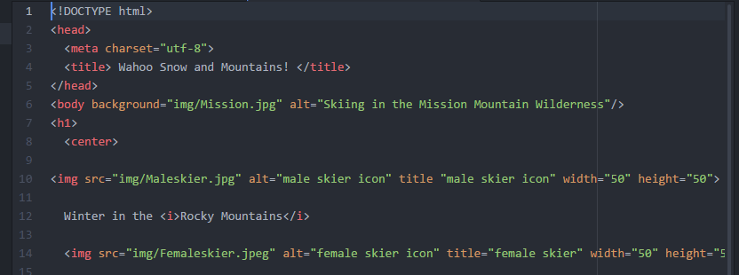

### Marc Hendrickson Sec:51

# **Assignment #5**

## *Introduction*

This week went fairly smooth, I encountered very small problems with my code, however nothing that I could not figure out on my own. I liked learning about images, since taking photographs has always been an important hobby for me. I did run into a problem this week with SourceTree; the program stopped 'pushing' to my GitHub repo. However, after perusing the [Atlassian Website](https://support.atlassian.com/help/sourcetree/) I found out that all I needed to do was to update the program to fix the problem. Overall, it was a successful week with not too many setbacks and the ones I did encounter were easily fixable.

## *Building my Website*

Coding with html5 is getting much easier and second-nature to me, I did not think that I would have said that three weeks ago. But the main attributes of coding in html5, like the structure of the entire page and how to keep organized while coding, have been steadily becoming easier with each week. I did however have slight problems this week, for instance with my pictures showing up after I published my page for the first time. When I previewed my page by just opening the Index.html file in Chrome all of my pictures showed up and at the right size. Then, once I pushed it to my GitHub account and tried to view as a live website some of the pictures didn't show up and others seemed much larger than the preview. The weird thing was when I was trying to fix why my images didn't show up the coding was exactly how it should be. To fix it all I did was to retype the code and add spaces before and after all of the individual attributes within the '' tag. After fixing all of my pictures in the website I ended up with image tags that looked like this:

 

## *Conclusion*

I really enjoyed working this week on my website, I feel like I am finally able to create something that is my own work and not just trying to copy lines of code so that it shows up exactly how the professor did the assignment. I also used my experience with this class in my GIS class more this week. I am able to move much more quickly through ArcMap and ArcCatalog creating databases and querys because I am somewhat familiar with writing simple code. I helped one of my classmates this week with how to organize her parent and child directories. I will keep looking at the wiki to see if I can help any of my other classmates since I figured this weeks homework out early and without too many problems.
